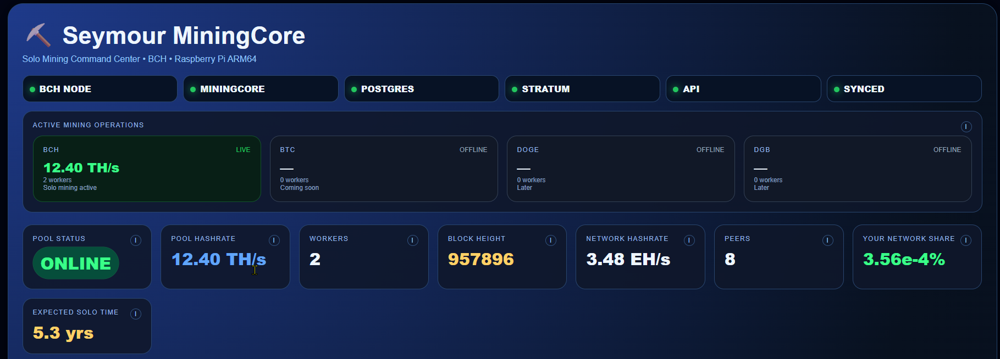
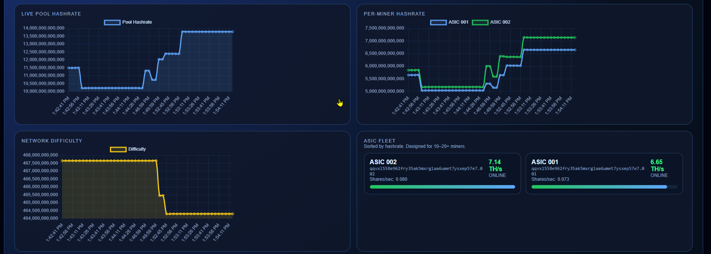
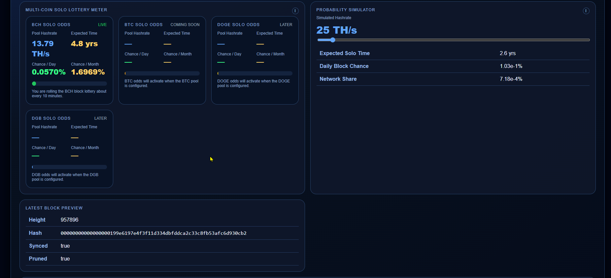
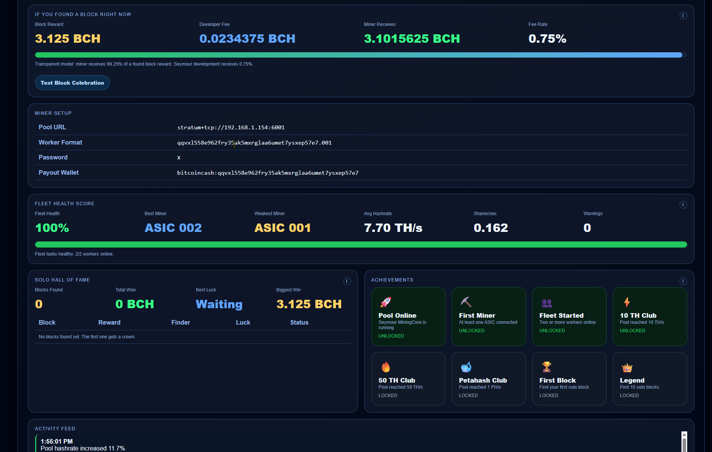
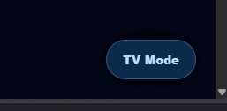
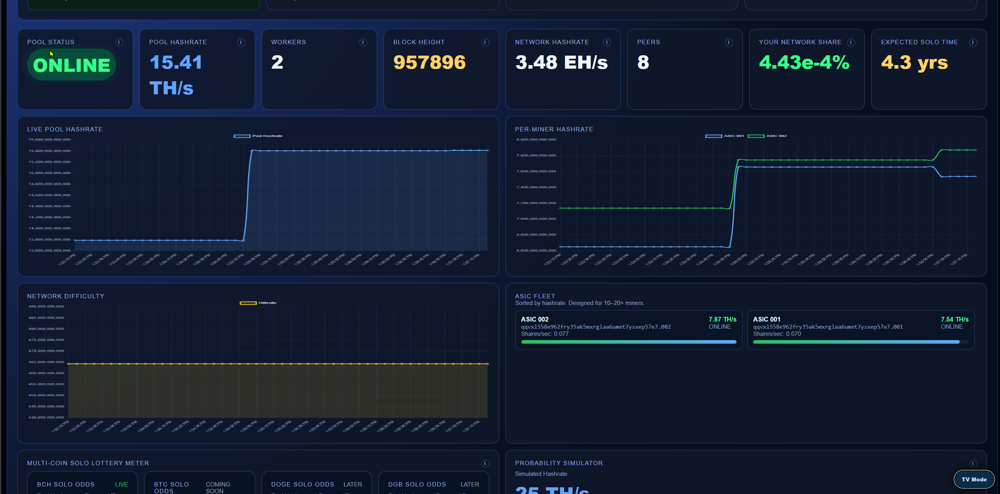

# Seymour MiningCore

> A modern command center for solo cryptocurrency mining.


> 🏆 **Blocks Found by Seymour MiningCore Users:** *Coming Soon*

------------------------------------------------------------------------

# Dashboard



The Seymour MiningCore dashboard provides a real-time overview of your
mining operation with live statistics, charts, network information, and
worker monitoring.

------------------------------------------------------------------------

# Live Pool Analytics



Features include:

-   Live Pool Hashrate
-   Per-Miner Hashrate
-   ASIC Fleet Command Center
-   Interactive Charts
-   Click-to-expand graphs

------------------------------------------------------------------------

# Solo Lottery & Probability



Know exactly where you stand.

-   Daily chance
-   Weekly chance
-   Monthly chance
-   Expected solo time
-   Latest block information
-   Probability simulator

------------------------------------------------------------------------

# Fleet Statistics



Monitor the health of your mining farm.

-   Fleet Health Score
-   Block Race Meter
-   Solo Hall of Fame
-   Achievement System
-   Historical Statistics

------------------------------------------------------------------------

# TV Mode



Perfect for mounting on a monitor in your mining room.

Large fonts, rotating statistics, and live status updates.

------------------------------------------------------------------------

# TV Dashboard



A dedicated full-screen monitoring interface for 24/7 operation.

------------------------------------------------------------------------

# Features

-   Multi-coin dashboard (BCH, BTC, DOGE, DGB and more)
-   Live ASIC fleet monitoring
-   Solo probability calculator
-   Expected solo time estimator
-   Fleet health scoring
-   Achievement system
-   Solo Hall of Fame
-   Block celebration screen
-   TV monitoring mode
-   Docker deployment
-   ARM64 / Raspberry Pi support
-   MiningCore compatible

------------------------------------------------------------------------

# Installation

Clone the repository:

``` bash
git clone https://github.com/imdmanuc2/seymour-miningcore.git
```

Follow the installation guide in the project documentation.

------------------------------------------------------------------------

Built with ❤️ for the solo mining community.
